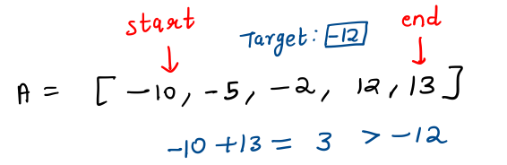
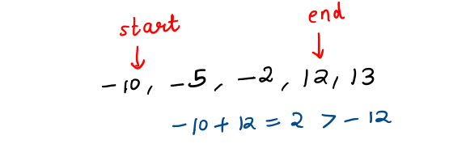
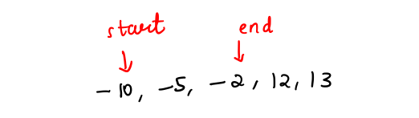

# 3Sum

## Problem Statement
Given an array of **nums** of **n** integers, are there elements *a*, *b*, *c* in **nums** such that *a + b + c = 0*? Find all unique triplets in the array which gives the sum of zero.

### Note
The solution set must not contain duplicate triplets.

### Example
Given array **nums** = [-1, 0, 1, 2, -1, -4],

A solution set is:

[
  [-1, 0, 1],
  [-1, -1, 2]
]

## Solution Approach 1 - Brute Force (Time Limit Exceeded)
Consider all possible triplets using 3 nested loops, and if the sum of the triplet equals 0, add it to a set of vector (after sorting those 3 numbers). This will make sure that the final result doesn't contain any duplicate triplets.

### Time Complexity
This solution takes a time complexity of `O(N^3 log N)`.

## Solution Approach 2 - Two Pointers
### Intuition
Let's say we fixed one of the numbers in the triplets as `x` and other numbers be `y` and `z`. 
Thus,
*y + z = -x*.

If we had sorted the elements in the given array, we can easily find a pair with given sum value using a `two-pointer` approach.

We maintain one `start` pointer at the beginning of the array, and an `end` pointer at the end of the array.

Considering the sum of values at these 2 positions:

- Less than the `target`: Shift the `start` pointer to right.
- Greater than the `target`: Shift the `end` pointer to the left.
- Equals the `target`: Congrats! You've found the pair.

Consider the given array (sorted) as 

A = [-2, -5, -10, 12, 13]

and you need to find a pair with sum = -12.

Initially, sum = 11 which is more than -12, thus shifting the end pointer to left.

Again, shifting the end pointer to the left.

Finally, you get a pair with sum = target.

We still need to make sure that we do not get duplicate triplets, and we do not miss one!

## Algorithm